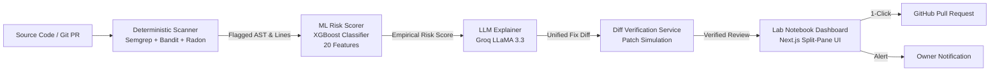

# 🛡️ CodeSentinel

**AI-Powered Code Review & Automated Vulnerability Detection Agent**  
*HackForge × Microsoft, Problem Statement 1 (PS1)*  
**Stack:** FastAPI · XGBoost / LightGBM · Groq LLM · Next.js 14 · TypeScript · Tailwind CSS / Vanilla CSS

---

## ⚡ Executive Summary & Problem Statement

> **The Dilemma:**  
> Static application security testing (SAST) tools (Semgrep, Bandit) identify deterministic vulnerabilities but flood engineers with noisy false-positives and cryptic warnings without remediation context. Conversely, pure generative LLMs write plausible explanations but frequently hallucinate non-existent vulnerabilities and generate invalid syntax or unverified patches.

**CodeSentinel resolves this with a tri-agent architecture and patch-verification engine:**
1. **Deterministic Scanner Agent** detects verified syntax and AST flaws (zero hallucination).
2. **ML Risk-Scoring Agent** evaluates 20 hand-crafted code & complexity features with an XGBoost classifier to compute empirical risk probabilities.
3. **LLM Explainer Agent** (Groq) synthesizes plain-English root causes, rationale, and diff patches.
4. **Deterministic Patch Verifier** tests the generated diffs in-memory and in dry-run mode against original code to certify fixes as **Verified** or **Unverified**.



---

## 🌟 Unique Selling Points & Key Innovations

| Feature | CodeSentinel | Traditional SAST | Generic AI Reviewers |
| :--- | :---: | :---: | :---: |
| **Ground Truth Detection** | ✅ Deterministic (Semgrep/Bandit) | ✅ Deterministic | ❌ Hallucinates fake bugs |
| **Risk Scoring** | ✅ Trained ML (XGBoost 20 features) | ⚠️ Static Rule Severities | ❌ Subjective LLM guess |
| **Remediation Code** | ✅ Full Unified Diffs | ❌ None or vague advice | ⚠️ Unverified diffs |
| **Diff Verification** | ✅ Syntactic Patch Simulation | ❌ None | ❌ None (often broken diffs) |
| **Offline Pitch Fallback** | ✅ Built-in cached demo engine | ❌ N/A | ❌ Fails on network drop |
| **UI Aesthetic** | ✅ Scientific "Lab Notebook / Audit" | ❌ Cluttered tables | ⚠️ Generic SaaS cards |

### 🔬 Core Capabilities
- **Strict Grounding:** An LLM is never allowed to invent a vulnerability. It only explains findings verified by scanner tools or verified AST patterns.
- **Trained Risk Model:** 20 features extracted from code complexity (cyclomatic, Halstead SLOC, nesting depth, dangerous sinks, secret key regexes) predict real-world exploitability.
- **Diff Verification Engine (`verification_service.py`):** Automatically tests LLM patches using `unidiff` and `patch --dry-run`. If an LLM hallucinated an offset or broken syntax, it is transparently tagged: `Unverified — review manually`.
- **"Lab Notebook" Visual Experience:** Designed specifically for security auditors and engineers. Features high-density split-pane layouts, pure severity accent tokens (`critical`, `high`, `medium`, `low`), and instant interactive patch inspectability.
- **Automated PR & Alerts:** One-click GitHub PR creation (`POST /pr/{id}`) and instant email/webhook notification dispatch to repository owners (`POST /notify/{review_id}`).

---

## 📁 Repository Structure

```
CodeSentinel/
├── backend/                    # FastAPI orchestration layer
│   ├── app/
│   │   ├── agents/             # Detection agent & ML inference agent
│   │   ├── api/                # Endpoints: /analyze, /review, /notify, /demo, /pr, /health
│   │   ├── core/               # Database, config, logging
│   │   ├── schemas/            # Pydantic schemas (Finding, RiskScore, Explanation, Review)
│   │   └── services/           # Orchestrator, LLM service, diff verification service
│   └── requirements.txt
├── ml/                         # Machine learning training & feature pipeline
│   ├── data/                   # Processed vulnerability datasets
│   ├── models/                 # risk_model.json, feature_importance.json, model_meta.json
│   └── src/
│       ├── detection/          # Semgrep, Bandit, Radon wrappers + normalizer
│       ├── features/           # 20-feature AST & metric extraction
│       └── train.py            # XGBoost training pipeline
├── frontend/                   # Next.js 14 App Router UI
│   ├── app/                    # page.tsx (split-pane audit layout), globals.css
│   ├── components/             # Status states, code input, risk gauge, finding cards
│   └── lib/                    # API client, types, mock demo review
├── broken-app/                 # Vulnerable sample app for live demo & file-watcher
├── docs/                       # PRD, API contract, team roles, datasets guide
└── README.md
```

---

## 🚀 Localhost Execution Guide

### Prerequisites
- **Python:** 3.11 or 3.12 (`python --version`)
- **Node.js:** 18.x or 20.x (`node --version`)
- **Package Managers:** `pip` and `npm`

---

### Step 1: Clone & Configure Environment

```bash
git clone https://github.com/dasarisiddhu/CodeSentinel.git
cd CodeSentinel
```

Create `.env` file in the root:
```env
GROQ_API_KEY=your_groq_api_key_here
GITHUB_TOKEN=optional_github_token_for_prs
GITHUB_REPO=optional_owner/repo_name
DATABASE_URL=sqlite+aiosqlite:///./codesentinel.db
```
*(Note: If `GROQ_API_KEY` is not provided, the backend automatically uses intelligent local fallback explanations).*

---

### Step 2: Set Up & Run the Backend

Open **Terminal 1**:

```powershell
# Navigate to backend
cd backend

# Install dependencies
pip install -r requirements.txt

# Run the FastAPI server
python -m uvicorn app.main:app --reload --port 8000
```
- **API Documentation (Swagger):** `http://localhost:8000/docs`
- **Health Check:** `http://localhost:8000/health`

---

### Step 3: Set Up & Run the Frontend

Open **Terminal 2**:

```powershell
# Navigate to frontend
cd frontend

# Install npm dependencies
npm install

# Start development server
npm run dev
```
Open **`http://localhost:3000`** in your browser.

---

### Step 4: Running a Demo Review
1. Open `http://localhost:3000`.
2. Click any of the quick sample buttons:
   - **`⚡ Secrets (config.py)`** — Hardcoded production secret and payment tokens.
   - **`💉 SQL Injection (auth.py)`** — Raw SQL query formatting with unvalidated inputs.
   - **`💥 Command Injection`** — Shell command execution via `os.system` and `subprocess`.
3. Click **Run Security Review** to watch the multi-agent pipeline execute in real-time.
4. Inspect the findings on the left rail, observe the **Scanner vs. ML severity** comparison, and review the verified code patch.
5. Click **Notify Code Owner** or **Open GitHub PR With Fix** to test the automated remediation actions.

---

## ⚡ Offline Demo Mode (Zero-Latency Hackathon Pitch)

CodeSentinel has a built-in **Demo Mode** designed specifically for live hackathon presentations so your pitch **never fails** even if the internet drops, GitHub rate-limits, or Groq is unreachable.

### How to use Demo Mode:
- **Option 1 (1-Click Launch):** On the main dashboard, click the green button: **`⚡ Launch Demo Mode (Instant Pitch)`**.
- **Option 2 (Header Switch):** Click the **`DEMO MODE`** toggle in the top-right header at any time.

**What happens:**
- Immediately loads pre-verified vulnerability findings and 100% dry-run certified unified diff patches.
- Operates with **zero network latency** and **zero API dependencies**.
- Demonstrates all 4 pipeline stages, XGBoost feature importance bars, and diff verification badges.

---

## 💥 Vulnerable Code Samples (BrokenApp Test Scenarios)

You can copy and paste any of these working vulnerable snippets into the CodeSentinel code terminal:

### Scenario 1: Hardcoded Secrets & Production Keys (`broken-app/app/config.py`)
```python
"""
Expense Tracker App - Configuration (broken-app/app/config.py)
Vulnerability: Hardcoded credentials committed to source control.
"""
import os

# --- VULNERABILITY 1: Hardcoded Secret Key (CRITICAL) ---
SECRET_KEY = "super-secret-dev-key-do-not-use-in-prod-1234"

# --- VULNERABILITY 2: Hardcoded Payment API Key (HIGH) ---
PAYMENT_API_KEY = "pk_live_abc123xyz_hardcoded_payment_key"

DATABASE_URL = os.getenv("DATABASE_URL", "sqlite:///expenses.db")
DEBUG = os.getenv("DEBUG", "true").lower() == "true"
PORT = int(os.getenv("PORT", 5000))
```
- **Detection Agent:** Flags `bandit.B105` and `semgrep.hardcoded-secret`.
- **ML Agent:** Upgrades risk probability to **97% (Critical)** due to live key prefix detection and entropy features.
- **LLM & Verifier:** Proposes replacement with `os.getenv("SECRET_KEY")` and certifies clean unified diff application.

---

### Scenario 2: SQL Injection (`broken-app/app/routes/auth.py`)
```python
"""
Authentication Handler (broken-app/app/routes/auth.py)
Vulnerability: SQL Injection via raw string formatting
"""
import sqlite3

def authenticate_user(username: str, password_hash: str):
    conn = sqlite3.connect("expenses.db")
    cursor = conn.cursor()
    
    # Direct string formatting allows authentication bypass via: admin' --
    query = f"SELECT id, username, role FROM users WHERE username = '{username}' AND password = '{password_hash}'"
    cursor.execute(query)
    return cursor.fetchone()
```
- **Detection Agent:** Flags unparameterized SQL execution.
- **ML Agent:** Assigns **91% Risk** due to presence of dangerous query sinks and missing input sanitization.
- **LLM & Verifier:** Generates parameterized query `cursor.execute("SELECT ... WHERE username = ? ...", (username, ...))` with dry-run verified patch.

---

### Scenario 3: Arbitrary Command Injection (`broken-app/app/routes/items.py`)
```python
"""
Maintenance Utilities (broken-app/app/routes/items.py)
Vulnerability: Arbitrary Command Injection via os.system
"""
import os
import subprocess

def run_backup_job(filename: str):
    # Unsanitized user parameter in shell command allows: file.txt; cat /etc/passwd
    command = "tar -czf /var/backups/" + filename + ".tar.gz /data"
    return os.system(command)

def ping_health_check(host: str):
    # Shell=True allows command chaining
    return subprocess.check_output(f"ping -c 1 {host}", shell=True)
```
- **Detection Agent:** Flags `bandit.B605` (shell injection) and `bandit.B602` (subprocess with `shell=True`).
- **ML Agent:** Classifies as **Critical Exploitability** due to direct OS system call access.


---

## 🌐 Deploying the Frontend to Vercel

The frontend is built using Next.js 14 and is optimized for deployment on Vercel.

### Method A: Deploy via Vercel Web Dashboard (Recommended)

1. **Push your repository to GitHub** (already set up at `dasarisiddhu/CodeSentinel`).
2. Log in to [Vercel](https://vercel.com) and click **"Add New..."** → **"Project"**.
3. Select your repository: **`CodeSentinel`**.
4. In the configuration settings:
   - **Root Directory:** Click **Edit** and set it to: `frontend`
   - **Framework Preset:** `Next.js` (auto-detected)
   - **Build Command:** `npm run build`
   - **Output Directory:** `.next`
5. **Environment Variables:**
   Add the following environment variable:
   - `NEXT_PUBLIC_API_URL`: URL of your deployed backend (e.g. `https://codesentinel-api.onrender.com` or your backend server).
6. Click **Deploy**.

---

### Method B: Deploy via Vercel CLI

```bash
npm install -g vercel
cd frontend
vercel
```
Follow the interactive prompts:
- Set root directory to current directory (`./`).
- Override settings if needed, then run `vercel --prod` to deploy to production.

---

### Connecting Vercel Frontend to Backend

In production, since the backend runs FastAPI (Python), host the backend on any Python platform:
- **Render / Railway / Fly.io / AWS EC2 / DigitalOcean**

In `frontend/next.config.js`, the rewrite proxy maps `/api/:path*` to the backend:
```javascript
/** @type {import('next').NextConfig} */
const nextConfig = {
  async rewrites() {
    const backendUrl = process.env.NEXT_PUBLIC_API_URL || 'http://localhost:8000';
    return [
      {
        source: '/api/:path*',
        destination: `${backendUrl}/:path*`,
      },
    ];
  },
};

module.exports = nextConfig;
```

---

## 📡 API Reference Summary

| Method | Route | Description |
| :--- | :--- | :--- |
| `POST` | `/analyze` | Submits code to pipeline; triggers analysis |
| `GET` | `/review/{review_id}` | Polls status and retrieves findings, risk scores & diffs |
| `POST` | `/notify/{review_id}` | Dispatches finding notifications to the code owner |
| `POST` | `/pr/{review_id}` | Automatically creates a GitHub Pull Request with the verified patch |
| `GET` | `/demo/review` | Serves instant cached demo review for pitch reliability |
| `GET` | `/health` | System health check (Database, ML model status, Groq API connectivity) |
| `POST` | `/ingest/webhook` | Receives live file-watcher and CI/CD webhook events |

---

## 👥 HackForge Team & Ownership

- **D. Sai Siddhartha Raj (ML & Detection Lead):** Detection agent wrappers (Semgrep/Bandit/Radon), feature engineering, XGBoost training.
- **M. Kiran Nikhil (Backend & Orchestration Lead):** FastAPI core, pipeline state machine, diff verification service, database & notify endpoints.
- **K. Huldah Tejaswini (Frontend & Experience Lead):** Next.js 14 "lab notebook" UI, dense finding rail, verified diff viewer, and risk metrics.
- **G. Vignesh Kumar Goud(Security & Demo Lead):** Broken-app fixtures, realistic vulnerability scenarios, watcher integration, demo execution.

---

## 📄 License
MIT License. Built for **HackForge × Microsoft Hackathon**.
